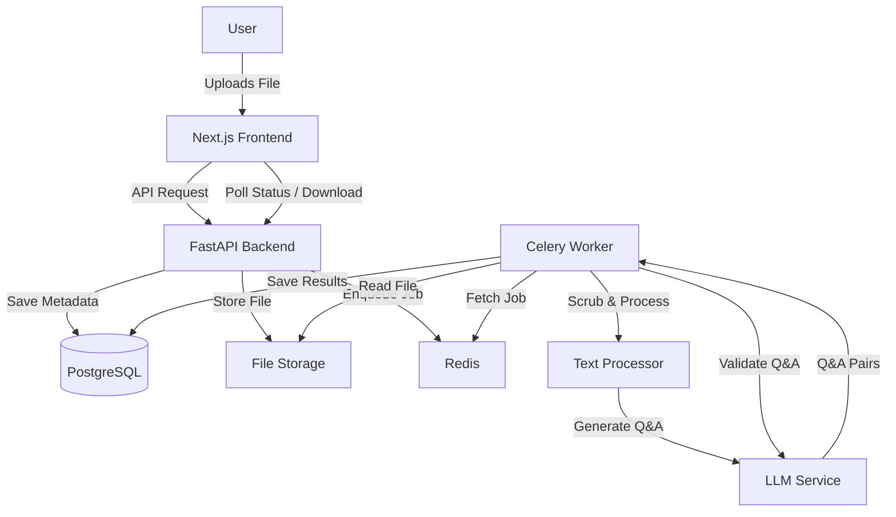

# Formatter - Architecture & Design

## Project Overview
Formatter is a SaaS web application that generates high-quality AI fine-tuning datasets (Q&A pairs) from various user-uploaded documents. It includes automated scrubbing, Q&A generation, validation, and optional augmentation.

## Tech Stack

### Frontend
- **Framework:** Next.js (React) - for server-side rendering, routing, and modern React features.
- **Language:** TypeScript - for type safety.
- **Styling:** Tailwind CSS - for rapid UI development.
- **Components:** shadcn/ui (or similar) - for accessible, re-usable components.

### Backend
- **Framework:** FastAPI (Python) - high performance, easy to use with async support (crucial for AI/IO tasks).
- **Language:** Python 3.10+ - rich ecosystem for AI and data processing.
- **Database ORM:** SQLModel (SQLAlchemy + Pydantic) - simplifies database interactions and validation.
- **Task Queue:** Celery with Redis - for handling long-running background tasks (file processing, AI generation).

### Infrastructure & Data
- **Database:** PostgreSQL - reliable relational database for user data, projects, and datasets.
- **Broker/Cache:** Redis - for Celery message brokering and caching.
- **File Storage:** Local filesystem (MVP) / AWS S3 (Production) - for storing uploaded files and generated datasets.
- **Containerization:** Docker & Docker Compose - for consistent development and deployment environments.

### AI & NLP
- **LLM Integration:** OpenAI API (GPT-4o/GPT-3.5) / Anthropic - for generation and validation.
- **Orchestration:** LangChain / LlamaIndex - for managing prompts and context.
- **Document Parsing:** `unstructured`, `PyPDF2`, `python-docx`, `BeautifulSoup4` - for extracting text from various formats.

## System Architecture



## Data Models (Preliminary)

- **User**: ID, email, hashed_password, created_at
- **Project**: ID, user_id, name, created_at, settings (augmentation options, etc.)
- **SourceDocument**: ID, project_id, filename, file_type, storage_path, status (uploaded, scrubbing, processing, complete, failed), raw_text
- **DatasetEntry**: ID, project_id, source_document_id (optional), prompt (question), completion (answer), quality_score, is_validated

## Key Workflows

1.  **Ingestion:**
    -   User uploads file.
    -   Backend validates file type.
    -   File stored securely.
    -   Background task triggered for scrubbing.

2.  **Scrubbing & Formatting (No-AI):**
    -   **Strictly deterministic:** No LLM usage in this phase to conserve costs and resources.
    -   **Extraction:** Uses `unstructured`, `PyPDF2`, `python-docx`, `BeautifulSoup4` to extract raw text.
    -   **Cleaning:** Regex and rule-based scrubbing to remove ads, navigation links, emails, excessive whitespace, and non-content artifacts.
    -   **Formatting:** Text is normalized and chunked specifically to optimize the downstream AI context window.

3.  **Generation:**
    -   Chunks sent to LLM to generate Q&A pairs.
    -   Prompt engineering ensures diversity and relevance.

4.  **Validation:**
    -   Generated pairs sent to "Critic" LLM.
    -   Scored based on accuracy, clarity, and format.
    -   Low-score items discarded or flagged.

5.  **Export:**
    -   User selects Project.
    -   Backend aggregates valid `DatasetEntry` items.
    -   JSONL or CSV generated and offered for download.

## Directory Structure
```
.
├── backend/
│   ├── app/
│   │   ├── api/
│   │   ├── core/
│   │   ├── db/
│   │   ├── models/
│   │   ├── services/ (AI, File Processing)
│   │   ├── tasks/ (Celery tasks)
│   │   └── main.py
│   ├── tests/
│   ├── Dockerfile
│   └── pyproject.toml
├── frontend/
│   ├── src/
│   │   ├── app/
│   │   ├── components/
│   │   └── lib/
│   ├── Dockerfile
│   └── package.json
├── docker-compose.yml
├── DESIGN.md
└── README.md
```
